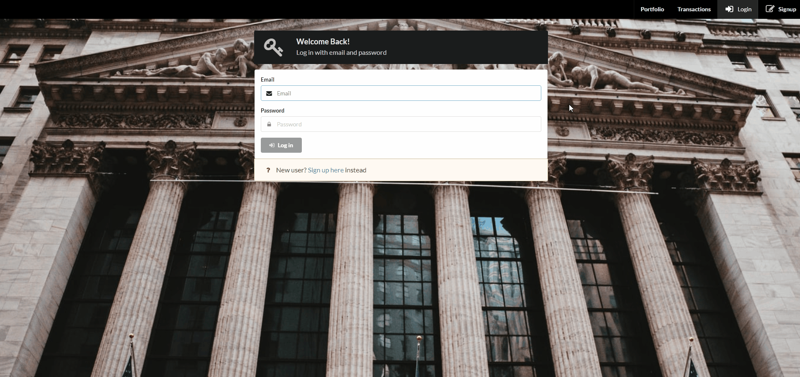

# Stock Portfolio App Demo

<!-- TABLE OF CONTENTS -->

## Table of Contents

- [About the Project](#about-the-project)
  - [Built With](#built-with)
- [Getting Started](#getting-started)
  - [Prerequisites](#prerequisites)
  - [Installation](#installation)
- [License](#license)
- [Contact](#contact)

<!-- ABOUT THE PROJECT -->

## About The Project



This is a stock portfolio web app created to showcase my full stack skills.
Users can register with their email, and buy and sell stocks. Up to date pricing
is pulled from IEX.

### Built With

- [Next](https://nextjs.org/)
- [MongoDB](https://www.mongodb.com/)
- [Express](https://expressjs.com/)
- [React](https://reactjs.org/)
- [Node](https://nodejs.org/en/)

<!-- GETTING STARTED -->

## Getting Started

Follow these steps to get a local copy up and running.

### Prerequisites

- npm

```sh
npm install npm@latest -g
```

- MongoDB

Install the
[local server](https://docs.mongodb.com/manual/administration/install-on-linux/)
or sign up for [cloud service](https://www.mongodb.com/download-center/cloud)

### Installation

1. Get a free API Key at [https://iexcloud.io/](https://iexcloud.io/)

2. Clone the repo

```sh
git clone https://github.com/maismin/stock-portfolio-app-demo.git
```

3. Install NPM packages

```sh
npm install
```

4. Add the environmental variables to `.env`

```text
MONGODB_URI = 'LINK TO YOUR LOCAL MONGDB SERVER OR CLOUD'
IEX_URI=https://cloud.iexapis.com/stable
IEX_KEY='YOUR IEX KEY'
JWT_SECRET='YOUR SECRET'
```

5. If using MongoDB local server, start it up with

```sh
sudo service mongod start
```

6. Start the web app

```sh
npm run dev
```

<!-- LICENSE -->

## License

Distributed under the MIT License. See `LICENSE` for more information.

<!-- CONTACT -->

## Contact

Simon Mai - maismin@gmail.com

Project Link:
[https://github.com/maismin/stock-portfolio-app-demo](https://github.com/maismin/stock-portfolio-app-demo)
